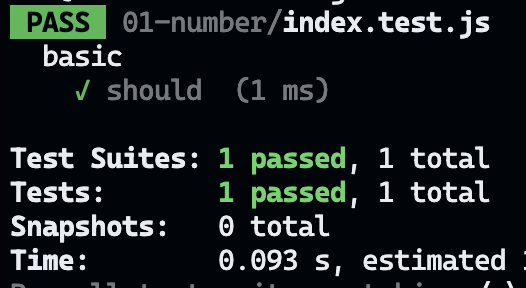

## 1. Make file ___.test.js
-  (File name).test.js

<br>
<br>

## 2. In file (File name).test.js 
```js
test('two plus two is four', () => {
  expect(2 + 2).toBe(4);
});
 ```

## 3. run  test
```
npx jest 01-number/index.test.js
```

## 4. output in TERMINAL


<br>

•	Test Suites: หมายถึงกลุ่มของไฟล์ทดสอบที่คุณรัน ซึ่งในกรณีนี้คือมี 1 ไฟล์ที่ผ่านการทดสอบสำเร็จ

<br>

•	1 passed: หมายถึง 1 Test Suite ผ่านการทดสอบ

<br>


•	1 total: หมายถึงมี 1 Test Suite ถูกทดสอบทั้งหมด

<br>


•	Time (0.141 s): ระยะเวลาที่ Jest ใช้ในการรันการทดสอบทั้งหมดในครั้งนี้ (0.141 วินาทีในตัวอย่างนี้)

<br>

• Estimated 1 s: เวลาประมาณที่ Jest คาดว่าจะใช้ในการรันการทดสอบ (1 วินาทีในตัวอย่างนี้) โดย Jest จะคำนวณค่าประมาณนี้จากการรันครั้งก่อนๆ เพื่อคาดเดาว่าการทดสอบทั้งหมดควรจะใช้เวลาประมาณเท่าไร