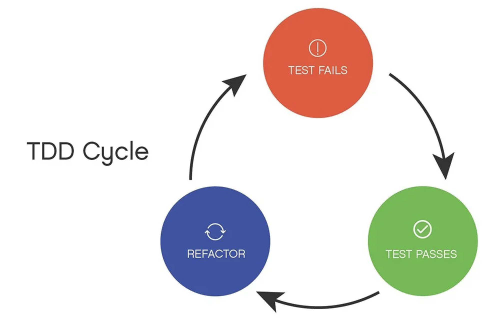

# Test-Driven Development (TDD)

## TDD คืออะไร
Test-Driven Development (TDD) คือแนวทางการพัฒนาโปรแกรมที่เน้นการเขียนชุดทดสอบก่อนการเขียนโค้ดจริง โดยมีขั้นตอนพื้นฐานดังนี้:

### ขั้นตอนของ TDD
1. **เขียนการทดสอบก่อน (Write a Test)**: เริ่มด้วยการเขียนชุดทดสอบสำหรับฟังก์ชันที่ต้องการพัฒนา การทดสอบนี้จะล้มเหลว (fail) เนื่องจากฟังก์ชันนั้นยังไม่ได้ถูกสร้างขึ้น

2. **ทำให้การทดสอบผ่าน (Make it Pass)**: เขียนโค้ดให้ฟังก์ชันที่ต้องการทำงานให้ผ่านชุดทดสอบที่เขียนไว้

3. **ปรับปรุงโค้ด (Refactor)**: เมื่อโค้ดผ่านการทดสอบแล้ว ทำการปรับปรุงโค้ดให้ดีขึ้น เช่น ทำให้โค้ดอ่านง่ายขึ้นหรือมีประสิทธิภาพมากขึ้น โดยที่การทดสอบยังคงผ่านเหมือนเดิม

กระบวนการ TDD จะวนซ้ำตามลำดับนี้ (เขียนทดสอบ -> ทำให้ทดสอบผ่าน -> ปรับปรุงโค้ด) จนกว่าจะพัฒนาโปรแกรมเสร็จสมบูรณ์ 

### &nbsp;&nbsp;&nbsp;&nbsp; 2.1  **TDD Cycle****
 

### ข้อดีของ TDD
- ช่วยให้มั่นใจว่าโค้ดทำงานตามที่คาดหวัง
- ลดจำนวนบั๊ก เพราะการทดสอบถูกสร้างขึ้นตั้งแต่แรก
- โค้ดที่ได้จะมีการออกแบบที่ดีขึ้น เพราะเราต้องคิดถึงการทำงานของโปรแกรมก่อนเขียนโค้ด

