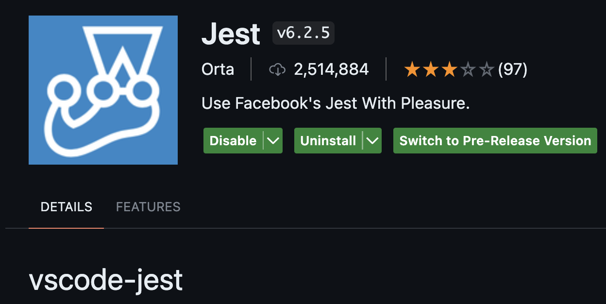
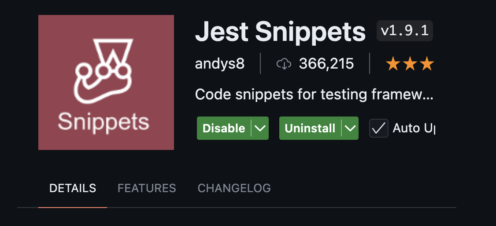

# setup Project

<br>

## 1. install  library


 > **npm install -D jest** 

<br>


## 2. install  extension


### &nbsp;&nbsp;&nbsp;&nbsp; 2.1  **Jest**
 
&nbsp;&nbsp;&nbsp;&nbsp; for ui run test and debug
### &nbsp;&nbsp;&nbsp;&nbsp; 2.1 **Jest Snippet**
 
 &nbsp;&nbsp;&nbsp;&nbsp; Code snippets for testing framework Jest

<br>

## 3. setup Scripts in _ package.json _ file
```json
  "scripts": {
    "test": "jest"
  },
```